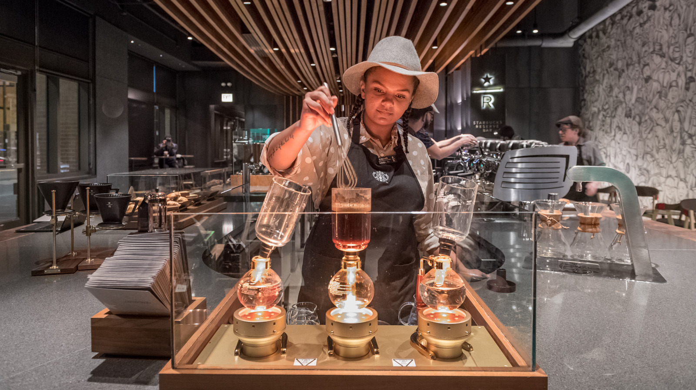

# Drink of Choice


The world's largest Starbucks is in downtown Chicago. Starbucks Reserve Roastery occupies five stories and 35,000 square feet. Such a large location has an equally large number of baristas, and of course, a very long line of customers. As you wait for your drink of choice, you notice that while each barista might take a different amount of time to prepare a drink, they are perfectly consistent **across** drinks.

The fifth barista might always take 3 minutes to make a drink, but the second barista always takes 7 minutes instead. If multiple baristas are available at the same time, the next customer goes to the barista with the **lower number**. As you wait in line, you decide to find out which barista is going to prepare your drink and when it will be ready.

## Assignment

Given a list of $N$ integers $t_i$, representing the time it takes for each barista to prepare a drink, find which barista is going to serve you and when you are getting your drink.

You should implement your algorithm in `barista.py` by completing the `solve()` function. This function takes an integer $N$ representing the number of baristas, an integer $K$ representing your position in line, and a list of integers `times` where the $i$-th element is the time it takes barista $i$ to prepare a drink. The baristas are numbered 1 to $N$, and the places in line also start with 1.

Your code must return two integers, the number of the barista that is going to serve you and when your drink is going to be ready.

**You may not use any external libraries beyond those in `requirements.txt` and Python's built-in modules.**

Download the necessary code from GitHub [here](https://github.com/Orecchia-Research-Group/barista).

## Testing

A number of test cases have been provided, and you can test your implementation by using the `pytest` library.

Install the required libraries by running the following command:

```bash
python3 -m pip install -r requirements.txt
```

Then you can run all the tests at once with the following command:

```bash
python3 -m pytest test_barista.py
```

The test cases and expected outputs are located in the `testcases` folder. If you want, you may add additional test cases by adding to this folder (but please do not modify the test cases we've provided).

On the first line, there are two integers, $N$ and $K$, representing the number of baristas and your place in line. The next line contains $N$ integers, the time it takes barista $i$ to prepare a drink.

The output files contain two integers in a single line, the number of the barista that will serve you and the time it will take for your drink to be ready.

Note that you do not need to do any parsing of these files yourself — that is handled for you by our tests.

You can invoke `pytest` in a number of ways. If you'd like, you can read up on that [here](https://docs.pytest.org/en/6.2.x/usage.html). Most notably, you can run a single test on its own with the `-k` flag. For instance:

```bash
python3 -m pytest -k input05
```

This command runs the test from `input05.txt`.

It can also be nice to see only the first test that fails, which can be done with the `-x` flag.
Finally, the `-v` flag will make test output more verbose, which can help you diagnose if tests are failing.

## Example

Here are some example inputs and outputs. You are given the times, and you need to output the correct barista and time.

| Sample Input | Sample Output |
|--------------|--------------|
| **Test 1** | |
| `2 4` | `1 20` |
| `10 5` | |
| **Test 2** | |
| `3 3` | `3 1` |
| `1 1 1` | |
| **Test 3** | |
| `5 4 1 1` | `1 180` |
| `1 2 3 4 5` | |
| **Test 4** | |
| `5 4 1 4` | `3 183` |
| `1 2 3 4 5` | |



## Limits and Notes

$1 \leq N \leq 10^5$<br>
$1 \leq t_i \leq 10^5$<br>
$1 \leq K \leq 10^9$<br>

The time your code has to pass any one test is **2 seconds**. The tests will timeout if your code takes longer than this time. Different machines run at different speeds, so the machine that matters here is the one that Gradescope uses when it tests your code after a submission (this is the output we will read when we grade your submission).

Note that $10^9$ is quite large, so any algorithm that is $O(K)$ runtime will take too long. Likewise, algorithms that take $O(\max(t_i) \cdot N)$ time will also take too long. Keep these facts in mind as you develop your algorithms.

It is also tempting to consider skipping time intervals of size $\text{lcm}(t_1, t_2, ..., t_N)$ and searching linearly on the final interval, but this doesn't quite work because this value can be very large (consider if all $t_i$ are prime, for example).

## Submission

Submit your code by uploading your `barista.py` to the separate coding assignment on Gradescope. This assignment is due at the same time as Homework 3 theory problems, and the same late policy applies.
